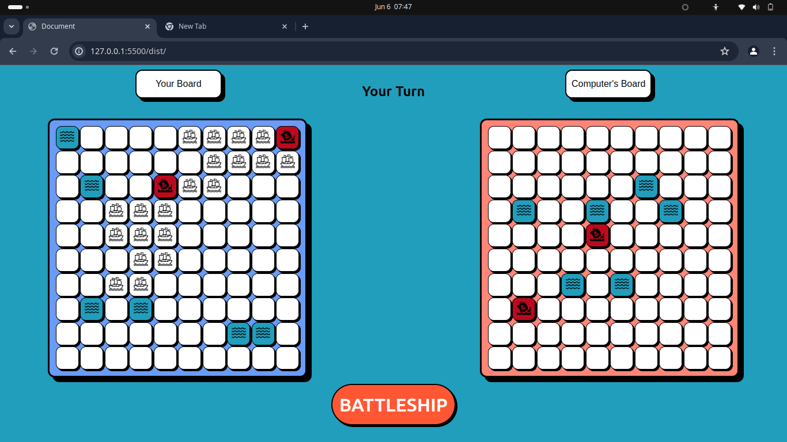

# Battleship Game

        > *Screenshot of the Web application *
        

## Short Description 🎲

This is a game based on the board game battleship. The main goal of the project was to explore Test driven development.


 ## Demo 🚴
-  click [Live Preview](https://mtendekuyokwa19.github.io/TaskManagementSystem/)to check it out!

#### Installation
1. clone the repo
- ```git@github.com:Mtendekuyokwa19/BattleShip.git```
2. Installation of all the pckages
- ```npm install```


 ## Features and Aspects

1. Placing of ships by clicking

    At the begging of the game the user enters all the ships by simply clicking the position they want.

2. Attacking

    The user can send attacks to the computer's board and alos receive attacks from computer.


               
3. Winning status
                                                
    The user will be told who won at the end of the Game


 ## Technologies and Tools 	🔧
 1. Webpack
 2. vanilla CSS
 3. Vanilla Javascript
 4. Chrome Dev tools
 5. Git
 6. Google fonts
 7. Figma And Figma community
 8. Github Pages
 9. npm
 1. Jest
 

 ## What I learned 🎓
 - Modular programming.
 - Object-oriented Programming
 - Functional programming
 - Test driven development 
 - Mocking

 ## Motivation 🧠
 - Mastering the principles of test driven development 

 ## Credits 🤝

 

 - [Figma Color palettes](https://www.figma.com/file/kVuVeHcwCENaBn4kKAxhGt/Dashboard---Dark-And-Light-Modes-%7C-Color-Variables-(Community)?type=design&node-id=7-1619&mode=design&t=ng4IU85pFsnxovSB-0)

## Future Update🔮
1. Drag and drop placing of the ships


